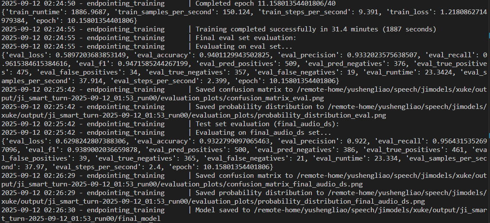

# Ji-VAD
本VAD仅支持汉语，未来计划增加对别的语言的支持
本VAD为语音VAD，在汉语情况下正确率约为93%，超过smart-turn的87.7%
### smart-turn的数据来源

猜测可能是LLM合成，然后tts合成。smart-turn的数据来源有可能和网站上的debate游戏和人工数据标注网站有关
### 数据合成

1. 使用ThatsGroes/dialog-topics，采用2000个话题，使用qwen-plus的api，每个话题生成五个口语句子，prompt见后
2. 使用如下比例，处理合成的口语句子，其中未结束是直接在句中选择词的结束位置进行切割。

| 类型  | 无语气词 | 中间有语气词 | 末尾有语气词 | 两处都有语气词 |
| --- | ---- | ------ | ------ | ------- |
| 未结束 | 0%   | 12.5%  | 25%    | 12.5%   |
| 结束  | 25%  | 25%    | 0%     | 0%      |

3. 最终得到的比例为：

| 类型  | 无语气词 | 中间有语气词 | 末尾有语气词 | 两处都有语气词 |
| --- | ---- | ------ | ------ | ------- |
| 未结束 | 0    | 1343   | 2419   | 1392    |
| 结束  | 2545 | 2312   | 0      | 0       |

4. 使用cosyvoice2生成语音，prompt语音的来源为[CV3-Eval](https://github.com/FunAudioLLM/CV3-Eval)的测试用zero-shot语音，由于这些语音是真实环境录制的，所以使用，得到demo见audio文件夹下内容
5. 在单张a100上，对smart-turn进行训练，得到结果如下:
![[image.png]]
我们的训练正确率为89.3%，略高于原先smart-turn v2的87.7%

---
1. 如果直接对音频进行切割，由于有句末语气词的要求，似乎并不可行？
### 使用大模型进行语句的切割和语气词的插入

| 类型  | 无语气词 | 中间有语气词 | 末尾有语气词 | 两处都有语气词 |
| --- | ---- | ------ | ------ | ------- |
| 未结束 | 0    | 1288   | 2486   | 1257    |
| 结束  | 2380 | 2529   | 0      | 0       |
2025.9.3 19:06:32 训练得到正确率为0.804
2025.9.4 9:49:07 训练得到正确率为0.902

为了解决大部分概率集中在0.5附近的情况，在loss增加如下项:
```python
central_rate = 0.05
loss += central_rate * torch.log(0.5 / torch.abs(0.5 - probs)).sum()
```

![[Pasted image 20250904094933.png]]

效果不佳可能和切割后句子仍然可以表达一个完整的意思有关
判断句子是否表达完整意思，应该可以使用大模型，或者强行人工数据标注。

---
最终使用了大模型切割+添加语气词，并且由于大模型切割后仍然可能为一个完整的句子，所以使用大模型再次判断句子是否完整，最终的正确率来到了93.2%


### 注
#### 1. 生成口语文本的prompt
```python
    prompt = f"""

    你是一个生成语音数据的助手，请生成一段主题为**{topic}**的中文口语文本，要求如下:

    1. 口语内容可以包含逗号、顿号、句号，使用尽量口语化的词汇

    2. 口语内容不要过长，尽可能在一句话内完成

    3. 可以是疑问句，也可以是回答，也可以是单纯的陈述句

    4. 不要包含无法转化为语音的内容，如表格、markdown语法内容、emoji表情等

    5. 是一个完整的句子

    6. 不要在句子的结尾和中间添加语气词

    7. 虽然主题是英文，但是生成的句子必须是汉语的

    现在生成五个口语文本，一个一行，不要生成除了口语文本外的任何文字，不要给每一个句子前面标号

    """
```

#### 2. 训练参数
```python
# Hyperparameters and configuration

CONFIG = {

    "model_name": "facebook/wav2vec2-base-960h",

  

    # Three types of dataset are used during in this script: training, eval, and test.

    #

    # - The eval set is used to guide the training process, for example with early stopping, and selecting

    #   the best checkpoint.

    #

    # - The test set is kept completely separate from the training process, and is periodically used to

    #   evaluate the performance of the model.

    #

    # The datasets in `datasets_training` are split 80/10/10, and used for all three purposes.

    # The datasets in `datasets_test` are only used for testing, and are not split.

    #

    # All test datasets are stored and reported separately.

    "datasets_training": [

        "/obs/xuke/smart-turn/llm_gen_topic_cn_punc_audio",

    ],

    "datasets_test": [], # e.g. "/data/datasets/human_5_filler"

  

    # Training parameters

    "learning_rate": 5e-5,

    "num_epochs": 40,

    "train_batch_size": 16,

    "eval_batch_size": 16,

    "warmup_ratio": 0.2,

    "weight_decay": 0.01,

  

    # Evaluation parameters

    "eval_steps": 500,

    "save_steps": 500,

    "logging_steps": 100,

}
```

### 3. 使用大模型进行切割的prompt
```python
prompt = f"""
你是一个生成语音数据的助手，请根据我给出的口语句子，对句子进行切割，要求如下：

1. 切割位置必须为一个词的结尾，也就是说你必须确保切割后不会破坏任何一个词

2. 尽量自然地进行切割，你要做的是模拟人类说话时没有说完的情况

3. 切割位置应该在句子中间位置，不要过于靠前也不要过于靠后

4. 切割完的句子不要过短，尽量在四个词以上

5. 切割完的句子最后一个字符不要是标点符号，也就是切割位置不要在标点符号之后

6. 直接返回切割后剩下的句子，一个一行，不要有任何的提示语

  

示例如下：

切割前: 这首键盘编的是真好，很好的呈现出了宇宙感

切割后: 这首键盘编的是真好，很好的

  

下面切割这几个句子:

{texts}
"""
```

#### 4. 使用大语言模型添加语气词的prompt
```python
prompt = f"""
你是一个生成语音数据的助手，请根据我给出的口语句子，仿照人类的说话习惯，在句子中添加语气词，要求如下:

1. 你的任务是在未必完整的句子中添加语气词来模仿人们说话时常见的停顿、思考现象

2. 推荐使用"嗯，"、"额，"、"那个，"、"这个，"等语气词，不只限于这四个，你也可以提出一些别的语气词

3. 语气词必须在句子中间添加，添加语气词的位置不能太过靠前，也不能太过靠后，更不能在句子的末尾

4. 仅添加语气词，不得改变句子的原意，添加"这个"或者"那个"时要使得语气词没有实际意义

5. 语气词前面和后面都加上"，"逗号，来表示停顿

6. 添加语气词的位置必须自然，一定不能在句子的末尾

7. 直接返回添加语气词后的句子，一个一行，不要有任何的提示语

8. 如果句子不完整，也不能在句子的末尾添加语气词

  

切记：

**无论如何也不能在句子末尾添加语气词**

  

示例如下：

切割前: 中午刚吃完

切割后: 中午刚，额，吃完

  

禁止的例子：

切割前: 我手头上还有

切割后: 我手头上还有，这个，(不能在句子末尾添加语气词)

  

下面切割这几个句子:
{texts}
"""
```
