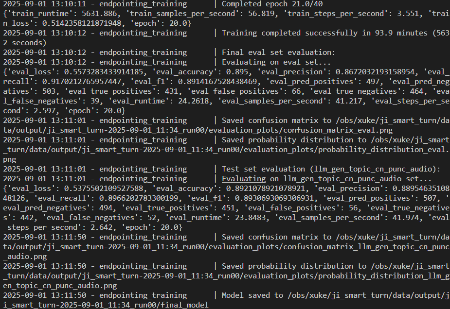

# Clean Chinese Audio Data
1. 通过chirp提取出中文语音
2. 使用ASR识别文本
3. 清理文本
4. 使用MOSS-TTSD生成更好的语音
5. 训练VAD

2.步骤中ASR效果不佳，放弃此路线

现在考虑[NVSpeech170k](https://huggingface.co/datasets/Hannie0813/NVSpeech170k)这个数据集
使用这个数据集，加上音频切分，可以得到是否结束说话的两方面数据

也可以加上KE-Team/SemanticVAD-Dataset数据集

# 2025.8.29工作
1. 使用jieba分词，尝试把句子分割，然后MOSS tts，这个先尝试50个，进行评价(太诡异了，失败)
2. 尝试更换cosyvoice2，是否可以用[cosyvoice3](https://github.com/FunAudioLLM/CV3-Eval)的语音
3. MOSS_TTSD生成效果不佳可能是没有prompt音频导致的
4. MOSS_TTSD仍然难以使用，最终决定使用cosyvoice2

# 2025.8.30工作
1. cosy voice2效果优秀
2. 决定使用[cosyvoice3](https://github.com/FunAudioLLM/CV3-Eval)的语音作为prompt语音，计划明天对这部分原始语音进行处理

# 2025.8.31工作
[0, 2215, 1224, 2362, 2202, 0, 1151, 0]
没有结束并且没有语气词的不存在
结束并且没有语气词的有 25%
没有结束但是中间有语气词的有12.5%
结束中间有语气词的有25%
| 类型 | 无语气词 | 中间有语气词 | 末尾有语气词 | 两处都有语气词 |
| --- | --- | --- | --- | --- |
| 未结束 | 0 | 12.5% | 25% | 12.5% |
| 结束 | 25% | 25% | 0% | 0% |

完成了语气词的添加
下面进行语音合成
正在进行合成，预计明天完成

# TODO
1. 整合[KETeam](https://huggingface.co/datasets/KE-Team/SemanticVAD-Dataset)的内容
2. 扩展英文支持

---
尝试自行训练smart-turn，训练完成，准确率大约为0.892，相较原先smart-turn的0.877提高了1.7%

